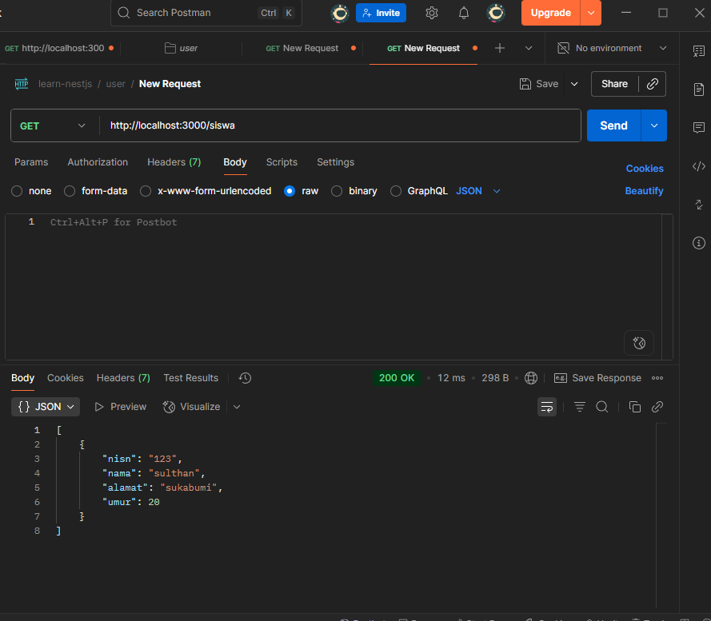
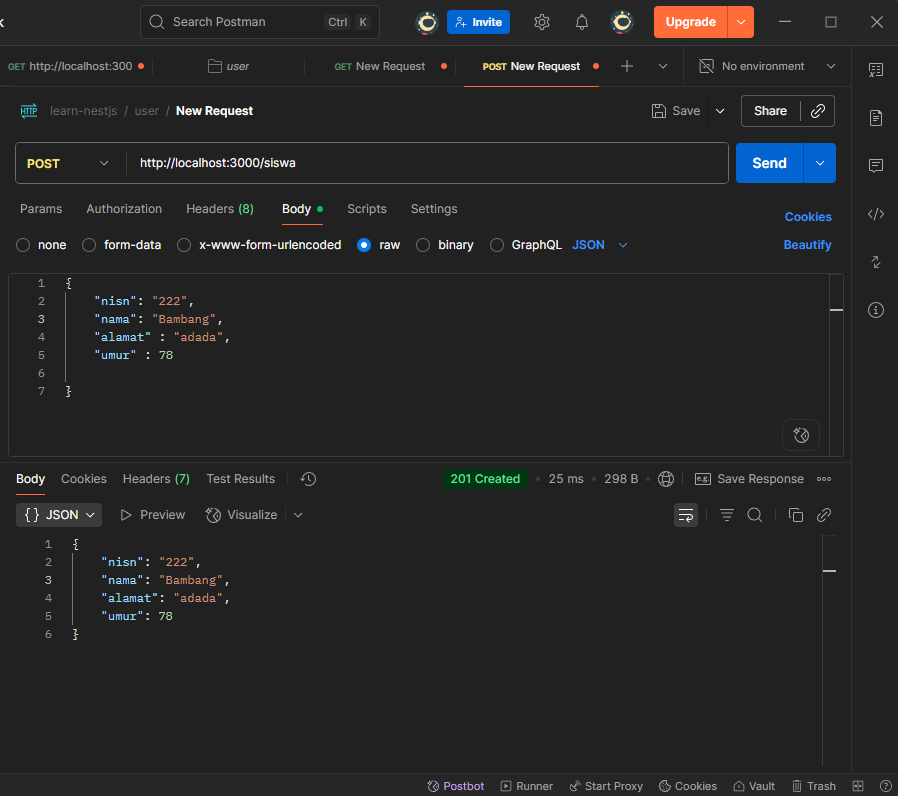
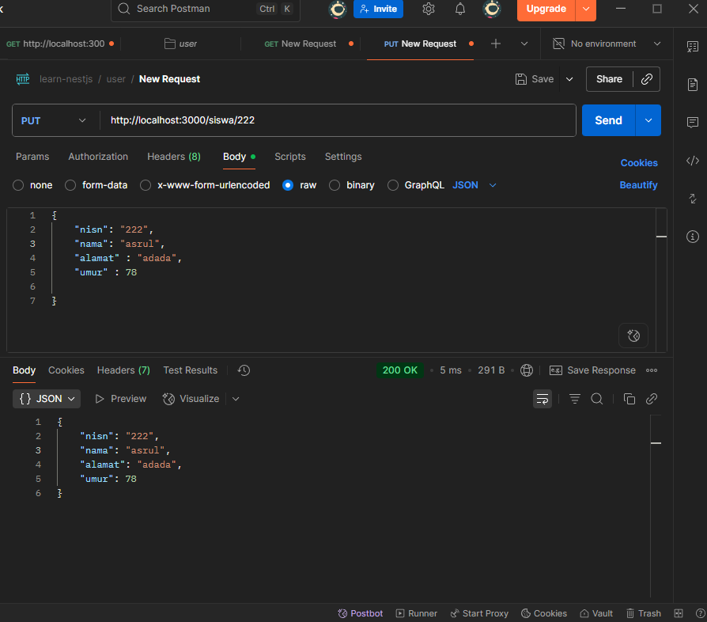
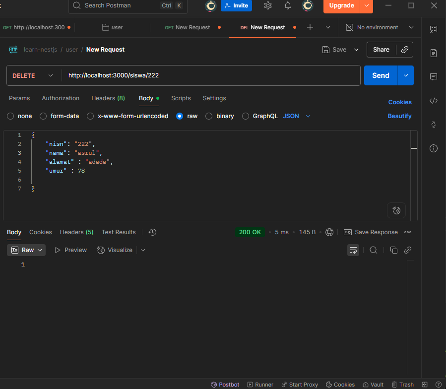

# CRUD Siswa Sederhana (Tanpa Database)
API ini adalah implementasi sederhana Todo List menggunakan **NestJS** tanpa database.
Semua data disimpan di dalam array agar mudah dipahami dan diujikan menggunakan **Postman**.
Proyek ini dibuat untuk memenuhi tugas pembuatan API Todo List, dengan endpoint CRUD dasar.

## 👤 Identitas
Nama: Muhammad Rabbani Aryanta
Kelas: XI RPL 1

## 📜 Deskripsi
Proyek ini adalah implementasi CRUD (Create, Read, Update, Delete) data siswa menggunakan Express.js tanpa database. Data siswa disimpan dalam array di memori. API ini dapat diuji menggunakan Postman.

## 🗂️ Struktur Data
Setiap siswa memiliki struktur data berikut:

{
  "nisn": "string",
  "nama": "string",
  "alamat": "string",
  "umur": 0
}

## ✨ Fitur Utama
| Method | Endpoint       | Deskripsi                         |
| ------ | -------------- | --------------------------------- |
| GET    | `/siswa`       | Ambil semua data siswa            |
| GET    | `/siswa/:nisn` | Ambil data siswa berdasarkan NISN |
| POST   | `/siswa`       | Tambah data siswa baru            |
| PUT    | `/siswa/:nisn` | Ubah data siswa berdasarkan NISN  |
| DELETE | `/siswa/:nisn` | Hapus data siswa berdasarkan NISN |

## 🖼️ Screenshot

